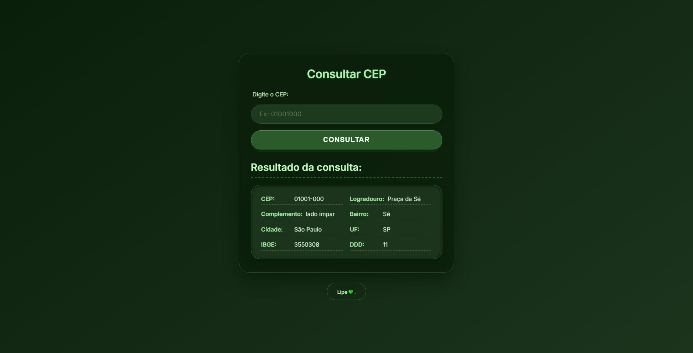

# 📦 Consulta CEP com Flask e ViaCEP


Aplicação web desenvolvida com **Flask** que permite consultar endereços brasileiros a partir de um CEP, utilizando a **API gratuita ViaCEP**. Interface moderna com **tema verde profundo** e design responsivo.

  

---

## ✨ Funcionalidades

- ✅ Validação de CEP (apenas dígitos, 8 caracteres)
- ✅ Consulta automática à API ViaCEP
- ✅ Exibição detalhada do endereço: logradouro, bairro, cidade, UF, CEP, complemento, IBGE e DDD
- ✅ Tratamento de erros (CEP inválido, não encontrado, falha de conexão)
- ✅ Interface moderna com tema verde escuro (green deep)
- ✅ Design responsivo (funciona em mobile e desktop)

---

## 🛠 Tecnologias utilizadas

- **Back-end**: Python 3, Flask, Requests
- **Front-end**: HTML5, CSS3 (com Google Fonts)
- **API**: [ViaCEP](https://viacep.com.br/) (serviço público e gratuito)

---

## 📁 Estrutura do projeto
consulta-cep-flask/
│
├── app.py               # Inicialização do Flask
├── views.py             # Rotas e lógica de consulta
├── templates/
│   └── home.html        # Página principal
├── static/
│   └── style.css        # Estilização completa
├── requirements.txt     # Dependências do projeto
└── README.md            # Documentação

---

## 🚀 Como executar localmente

### Pré-requisitos

- Python 3.8 ou superior instalado
- Git (opcional, para clonar)

### Passo a passo

1. **Clone o repositório** (ou baixe o ZIP)

```bash
git clone https://github.com/JorgeLineZin/consulta-cep-flask.git
cd consulta-cep-fla
```

2. **Crie e ative um ambiente virtual(recomendado)**

    python -m venv venv
    
    No Windows:
    venv\Scripts\activate
    
    No Linux/Mac:
    source venv/bin/activate

3. **Instale as dependências**
    pip install -r requirements.txt

4. ***Execute a aplicação**

```bash
python app.py
```

5. **Acesse no navegador**
    http://127.0.0.1:5000